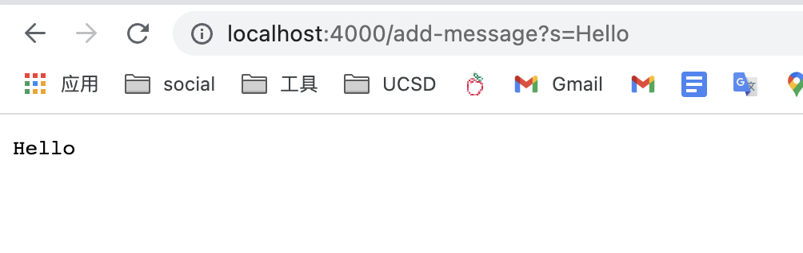
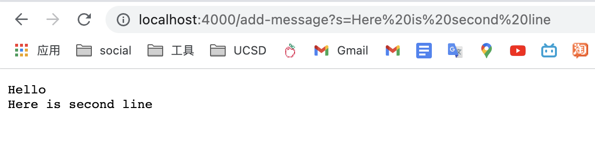
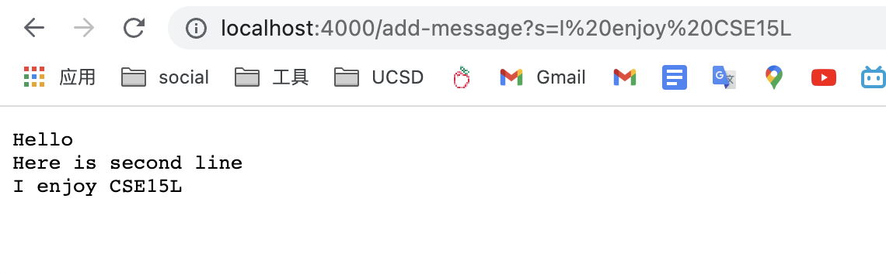
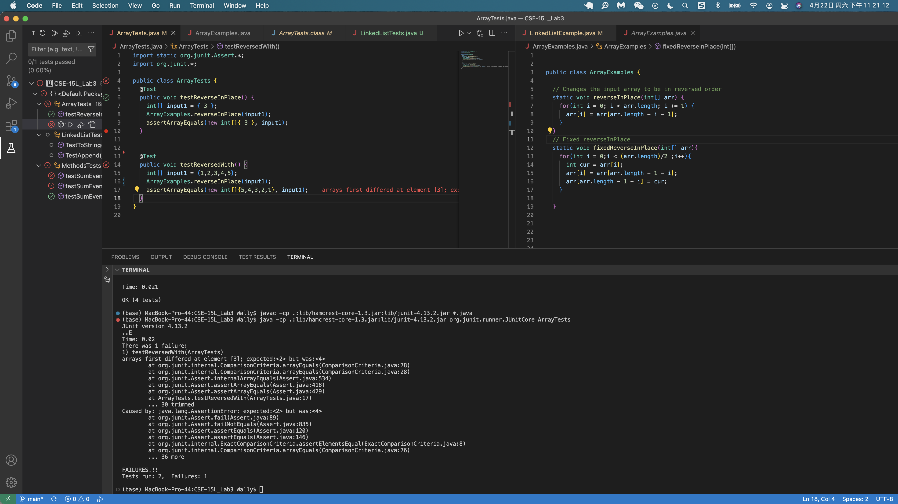

# Part1
Here is the code for my StringServer:
```
import java.io.IOException;
import java.net.URI;
import java.util.ArrayList;
public class SearchEngine implements URLHandler{
    ArrayList<String> lst = new ArrayList<>();
    public SearchEngine(){
        this.lst = lst;
    }
    public String handleRequest(URI url){
        if (url.getPath().contains("/add-message")){
            String[] parameters = url.getQuery().split("=");
            if(parameters[0].equals("s")){
                this.lst.add(parameters[1]);
            }
            return String.join("\n",this.lst);
        }else{
            return "404 nothing found";
        }

        
    }
}
class StringServer {
    public static void main(String[] args) throws IOException {
        if(args.length == 0){
            System.out.println("Missing port number! Try any number between 1024 to 49151");
            return;
        }

        int port = Integer.parseInt(args[0]);

        Server.start(port, new SearchEngine());
    }
}
```
Here is the screenshots of using `add-message`




* `Main` method, `Server.start` method, and `handleRequest` method in Handler class are called.
* Essentially I am called the main method in StringServer class. I pass in 4000 as the local host server number this argument is used for port for later method. In the main method, I passed in a new `SearchEngine` object and `port`(a integer(input argument of main method)) as  input for Server object `start` method. Inside the Server.start method, `server.createContext` is called and it takes a String `path` and URLHandler Object `handler` as arguments.
* In my `handleRequest` method, `this.lst` will change everything when the new request has correct query. `this.lst` is a ArrayList that store all of the queries that requested before. And everytime we called the function, it will return them as a String that seperated in different lines.

# Part2
## Failure-inducing input for `reverseInPlace()` function:
```
@Test
  public void testReverseInPlaceWith5Element() {
    int[] input1 = {1,2,3,4,5};
    assertArrayEquals(new int[]{5,4,3,2,1}, ArrayExamples.reverseInPlace(input1));
  }
```
## Input that doesn't induce a failure for `reverseInPlace()` function:
```
@Test 
	public void testReverseInPlace() {
    int[] input1 = { 3 };
    ArrayExamples.reverseInPlace(input1);
    assertArrayEquals(new int[]{ 3 }, input1);
	}
```
## Symptom

## Bug and How it was fixed
* Before(with bug)
```
static void reverseInPlace(int[] arr) {
    for(int i = 0; i < arr.length; i += 1) {
      arr[i] = arr[arr.length - i - 1];
    }
  }
```
* After(without bug)
```
static void fixedReverseInPlace(int[] arr){
    for(int i = 0;i < (arr.length)/2 ;i++){
      int cur = arr[i];
      arr[i] = arr[arr.length - 1 - i];
      arr[arr.length - 1 - i] = cur;
    }
    
  }
```

* The original reverseInplace function fails because it will return a palindrome like list(symptom) based on the input. When we iterate the list, it override the first half of the list element. The way we solve is by only iterate the first half of the input arr and swap the `i` element with the `arr.length - 1 - i` element.

# Part3
From week2 and week3 lab, I learned about how to using the path and query from url and manipulate them to implement the effect we want. We can accomplished this by using `getQuery` method split '='. I also learn about using server to hold local host on my computer. I learned about the bug and symptom and using java command lines to run the test cases. I think these are all useful information for my future career!
