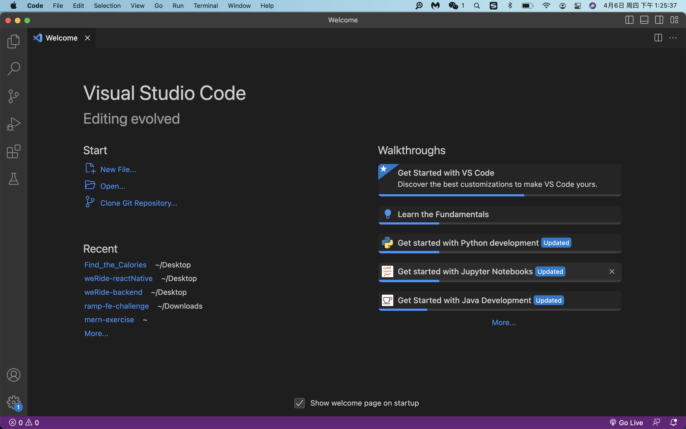
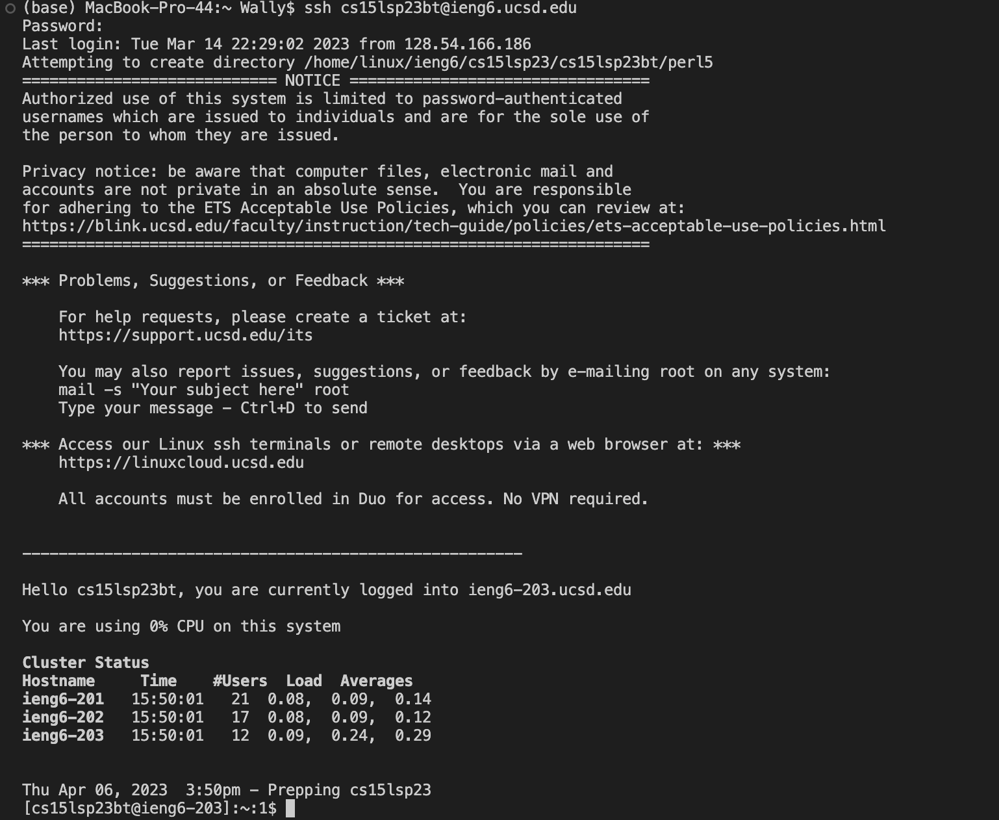
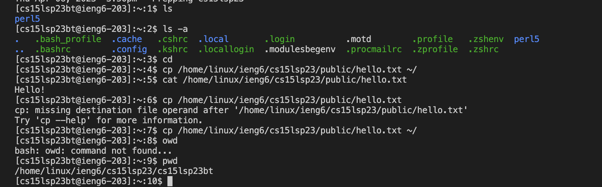

# Lab Report
## Step 1 VSCode 
Firstly, I need an application for all of my later cse 15l lab work, so I download the VSCode from  [Here](https://code.visualstudio.com/) and follow the instruction on this website to run the installing package on my MAC OS system. 
After I changes the background color and download numbers of plug-in, it look something like this:

## Step2 Remotely Connecting
After getting the account name and reset the password for CSE15L account. I can have access to the cse basement computers.
To connect remotely, I followed the following steps:
1. Open VSCode
2. Open terminal
3. To use **ssh** and enter the account name
  
`ssh cs15lsp23bt@ieng6.ucsd.edu`
  
4. Enter the password of my account 

Then I see the terminal message:

This indicates I am successfully connected remotely to the ucsd cs basement computer

## Step3 Trying Some Commands
Now it is time to play around. 

As the picture show above:
* I check the file in current path by use `ls`, and it shows that there is only a file called `perl5` in this path. 
* I try the command `ls -a` which will show all of the file including the hidden file. 
* I try the command `cd` which takes me to the home directory.
* I can check the home directory by using command `pwd`, it returns /home/linux/ieng6/cs15lsp23/cs15lsp23bt
* I am also able to check other path remotely such as /home/linux/ieng6/cs15lsp23/public/hello.txt 
* I can print the file by using `cat` and it print "Hello!"
* I also try to use `cp` command which can takes in a file and a directory, so this command can copy the file to the directory, the command doesn't work in the picture because I forget to include the file name. 
Pretty cool!

