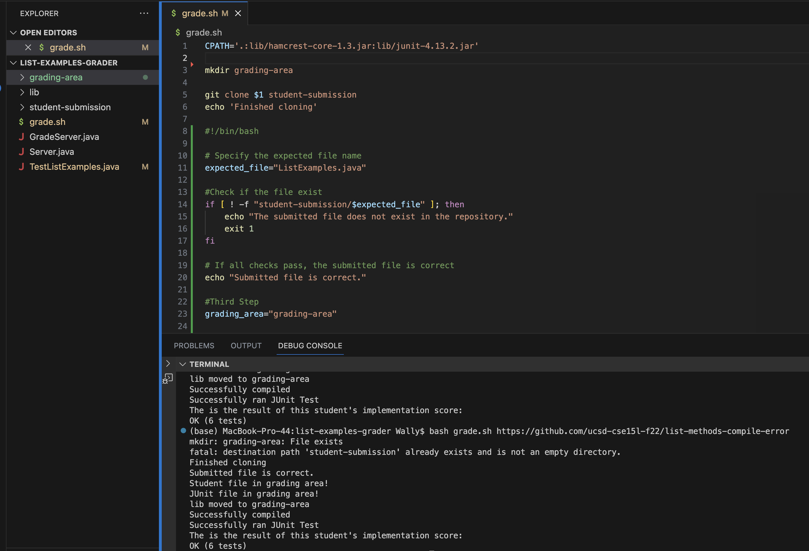
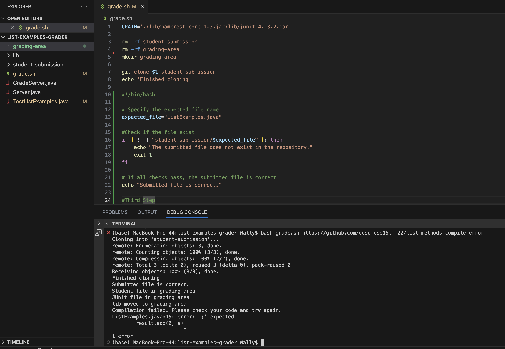
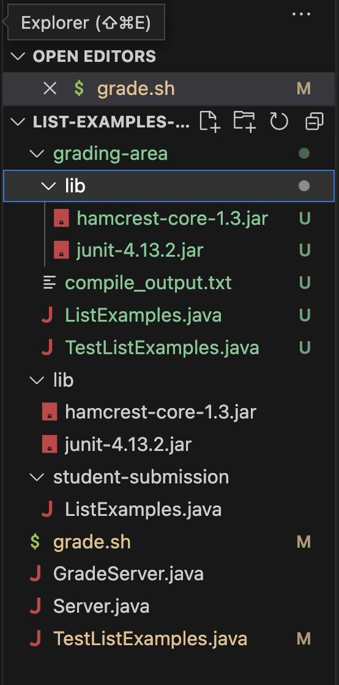

# Lab Report5

## Part 1
Benji, a first year Math CS major student attend CSE15L this quarter and made a post on Eds because he faced an error that he can not resolve. On the Eds, he wrote:

```
I am doing my Lab 6 for CSE15L. I need to write a bash file that takes a github repo http link as input to grade the student work, but somehow my bash file having this odd output when I am running this bash to grade https://github.com/ucsd-cse15l-f22/list-methods-compile-error, which has a syntax error of a missing semicolon. I suppose to have an compile error, but instead, this is what my terminal output look like. All the test is passed somehow...
```



## Part 2
Wally, a CSE15L TA, responds to Benji:
```You are doing a good job on trying the bash commands, but you need to be more thoughtful and careful before cloning the repository. Go back check the first two line of your terminal output. They indicates the issue you had, start from there and see if you can find a way to resolve that issue. Come back and respond to this command if you cannot figure it out!```


## Part 3
Benji saw the commands and when pay close attention to the first two lines of the terminal output. 
```
mkdir: grading-area: File exists
fatal: destination path 'student-submission' already exists and is not an empty directory.
```
Benji suddenly realized that he need to check if there already a fold called `grading-area` and `student-submission`. Benji conclude that the bug he had was traggered by previous repo clone file to the folder `student-submission`. In the first place, Benji grades a perfect student submission(has 0 bug) and this file was saved in the `student-submission`. After that Benji trys to clone another student submission(with compiling bug), this time, because there are already file in the `student-submission` folder, so java just run the JUnit test on the existing file instead of the new cloned file, and this resulting in giving the initial student submission result. Benji decide to use the command line `rm -rf`, which is a command that forcefully and recursively removes files and directories without asking for confirmation. Benji add the `rm -rf student-submission` and `rm -rf grading-area` on line 2 and line 3 in order to make sure that there is nothing in the folder and cause grading wrong student's submission. After trying this, the grading bash file successfully detect the compile error!


## Part 4
* The file & directory structure needed


* The contents of each file before fixing the bug
grade.sh file:
```
CPATH='.:lib/hamcrest-core-1.3.jar:lib/junit-4.13.2.jar'
# rm -rf student-submission                     <------------------ add these two lines to resolve the bug
# rm -rf grading-area                           <------------------
mkdir grading-area
git clone $1 student-submission
echo 'Finished cloning'

# Specify the expected file name
expected_file="ListExamples.java"

#Check if the file exist
if [ ! -f "student-submission/$expected_file" ]; then
    echo "The submitted file does not exist in the repository."
    exit 1
fi

# If all checks pass, the submitted file is correct
echo "Submitted file is correct."

#Third Step
grading_area="grading-area"

#copy file to folder
cp -r "student-submission"/$expected_file "$grading_area"
cp -r TestListExamples.java "$grading_area"
if [ ! -f "grading-area/$expected_file" ]; then
    echo "Grading area can not find student's submission."
    exit 1
fi
echo "Student file in grading area!"
if [ ! -f "grading-area"/TestListExamples.java ]; then
    echo "Grading area can not find JUnit."
    exit 1
fi
echo "JUnit file in grading area!"
cp -r lib grading-area
echo "lib moved to grading-area"

#locate to grading folder
cd "$grading_area"

#compile
javac -cp .:lib/hamcrest-core-1.3.jar:lib/junit-4.13.2.jar *.java > compile_output.txt 2>&1

# Check if compilation was successful
if [ $? -ne 0 ]; then
    echo "Compilation failed. Please check your code and try again."
    cat compile_output.txt
    exit 1
fi
echo "Successfully compiled"

java -cp .:lib/hamcrest-core-1.3.jar:lib/junit-4.13.2.jar org.junit.runner.JUnitCore TestListExamples > junit_output.txt
echo "Successfully ran JUnit Test"

# Extract the test results
score=$(tail -n 2 junit_output.txt | head -n 1)

# Display the grade
echo "The is the result of this student's implementation score:"
echo "$score"
exit 0

```
* The full command line (or lines) you ran to trigger the bug
`bash grade.sh https://github.com/ucsd-cse15l-f22/list-methods-compile-error`

* A description of what to edit to fix the bug
By adding the `rm -rf student-submission` and `rm -rf grading-area` on line 2 and line 3 in order to make sure that there is nothing in the folder and cause grading wrong student's submission. 


