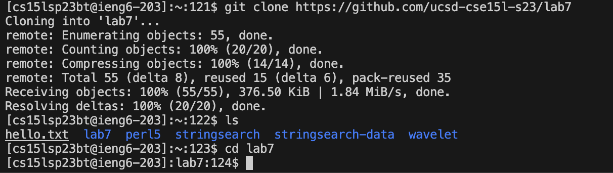

# Lab Report 4

## Step 4 Log into ieng6

In this step, in terminal, I entered `ssh cs15lsp23bt@ieng6.ucsd.edu` in order to access my remote ieng6 account. The message from the terminal indicate that I log in the remote account successfully!

## Step 5 Clone your fork of the repository from your Github account

In this step, I enter `git clone git@github.com:wallacezichen/lab7.git` in terminal to clone the repository to my remote account home directory.
To make sure that I clone the github repo successfully, I use `ls` to see the current directory files, and we see `lab7` folder is inside of our current directory indicate we indeed cloned successfully.
Lastly I go inside the `lab7` folder by using `cd lab7`.

## Step 6 Run the tests, demonstrating that they fail

After simply browse of the files inside folder `lab7`. We find that we can run the JUnit test by running `test.sh` file.
In this step, I firstly check the file in the folder by using `ls`.
Then I use `cat test.sh` to check what is in the `test.sh` file, surprisingly, the command lines are what we need to run the JUnit test.
Lastly I enter the command `bash test.sh` to run the bash file `test.sh`, and as the image showing, it we passed 2 tests and failed 1.

## Step 7 Edit the code file ListExamples.java to fix the failing test

We know that in order to pass all the JUnit test, we need to use `index1` instead of `index2` in the final loop in `merge` of `ListExamples.java` file.
The complete typing command on my keyboard look like:
`vim ListExamples.java` then `/below<enter>jhhhhhi<backspace>2<esc>:wq`
Let's explain what each steps means, I type `vim ListExamples.java` to get into the vim mode and start to edit the java file.
Then inside the vim, `/below<enter>` is used for search for the word. Because we notice that there is a annotation above the line we need to change, so I decide to use that as the search key word to help me locate near to the line which causes the bug.
Then I used `jhhhhh` to move one line blow and 5 space left in order to locate exactly the error. `j` stands for `<down>` and 'h' stands for `<-` in vim.
Than `i` is used for entering the insertion mode. `<backspace>2` is used to delete the original `index1`'s 1 and add 2 to make it `index2`.
After the edit, `<esc>` is used to escape from the insertion mode.
Lastly `:wq` is use for saving the file and exit vim.

## Step 8 Run the tests, demonstrating that they now succeed

Silimar to step 6. We enter `bash test.sh` to run the bash file `test.sh`. And we passed all of the test.

## Step 9 Commit and push the resulting change to your Github account

I did `git add ListExamples.java` to stages the changes you made to the ListExamples.java file for inclusion in the next commit
Then I did `git commit -m "fix error"` which creates a new commit with the changes you staged in the previous step.
Lastly I did `git push` to push the commit result to my github. In this step I also enter the passphrase for key '~/.ssh/id_rsa'
